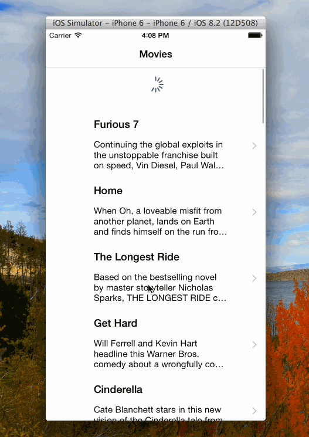

# Rotten Tomates

This is the Rotten Tomatos Movie application for iOS submitted for Homework 2
NOTE: THIS WAS DEVELOPED USING XCODE 6.2. DUE TO SOME CONFLICTS WITH OTHER PROJECTS I AM WORKING ON I HAVE NOT YET BEEN ABLE TO UPGRADE MY OS TO YOSEMITE AND SO XCODE 6.2 IS THE HIGHEST VERISON I COULD RUN AT THIS POINT. I AM HOPING TO DO THE UPGRADE LATER THIS WEEK. SOME FEATURES, INCUDING LOADING THE IMAGES USING THE UIImageView+AFNetworking LIBRARY COULD NOT BE DONE WITH THIS VERSION.

Time spent: 10 hours

Completed:

* [Done] User can view a list of movies from Rotten Tomatoes. 
* [Done] User can view movie details by tapping on a cell
* [Done] User can pull to refresh the movie list

Note: to embed the gif file, just check your gif file into your repo and update the name of the file above.
